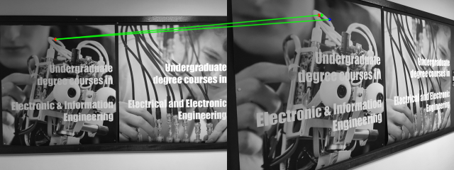
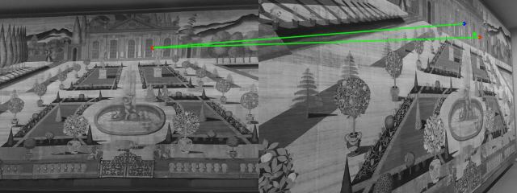

### Create matches between images using SuperGlue technic and 3rd image for improved results.

## Introduction
SuperGlue is a CVPR 2020 research project done at Magic Leap. The SuperGlue network is a Graph Neural Network combined with an Optimal Matching layer that is trained to perform matching on two sets of sparse image features. This repo includes PyTorch code and pretrained weights for running the SuperGlue matching network on top of [SuperPoint](https://arxiv.org/abs/1712.07629) keypoints and descriptors. Given a pair of images, you can use this repo to extract matching features across the image pair.

* Full paper PDF: [SuperGlue: Learning Feature Matching with Graph Neural Networks](https://arxiv.org/abs/1911.11763).

* Authors: *Paul-Edouard Sarlin, Daniel DeTone, Tomasz Malisiewicz, Andrew Rabinovich*

## Our Work

We used an additional image for improving accuracy.
for instance if there was a squence of images: image1,image2,image3.
and the target was to match between key points from image1 to image3.
We used image3 as an auxilary image as follows:
1. Calculate the scores between keypoints from image1 to image3
2. Calculate the scores between keypoints from image3 to auxilary(image2)
3. Calculate the scores between keypoints from auxilary(image2) to image1
that is to say we created a triangle whose edges are the scores mention in the 3 points above.

The base edge of the triangle is the score between image1 and image3.
The to other edges are the scores from image3 to auxilary and from auxilary to image1 respctively.
The average score of the two edges was calculated , and replaced with the "base" edge triangle score. 
Then SuperGlue was excecuted again to recalcualted the matches.
in the images the 1st row is the score of the edge(image1 image3)
the second row is the average of the scores(edges from image3 to auxilary and from auxilary to image1) after skinhorn algorithm was excecuted.
the 3rd column displays the base score before skinhorn algorthm was excecuted.

## here are some exmples. The red dot on the right is the point after our proccess. The blue dot is the point after SuperGlue. The green dot is the ground truth.

* The images were taken from (https://github.com/hpatches/hpatches-dataset)

